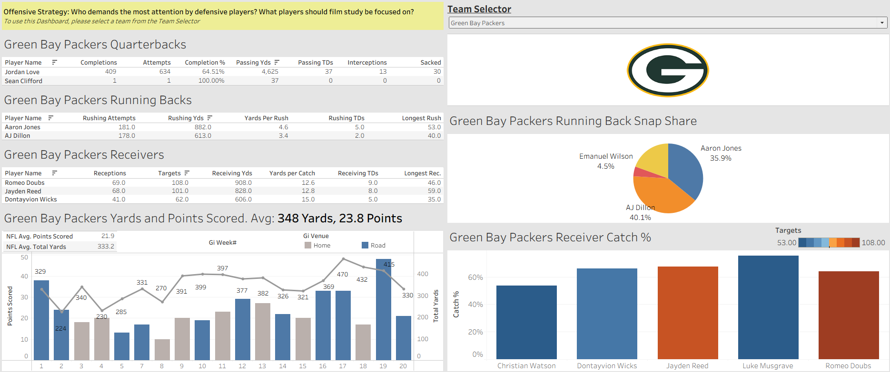
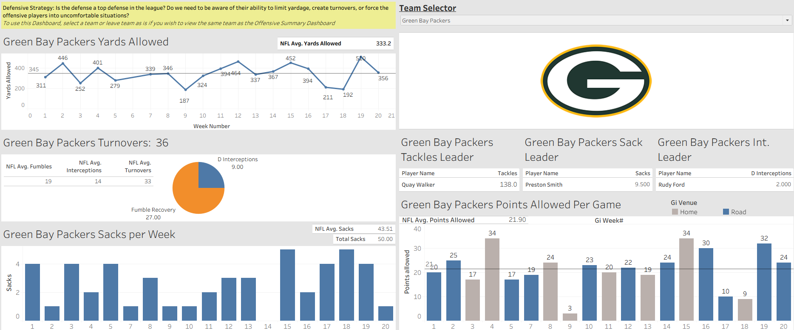

# NFL Statistics Dashboard

# NFL Team Performance Dashboard (2023 Season)

## Overview

This project presents an **interactive NFL dashboard built in Tableau**
using box score data from the 2023 season. The dashboard is designed to
allow users to explore **team-level and player-level offensive and
defensive performance** through intuitive, coach-oriented
visualizations.

The primary audience for this dashboard includes: - **NFL coaches**, who
can use the dashboard to support weekly game planning - **NFL
announcers**, who can quickly reference key player and team statistics
during broadcasts

The dashboard emphasizes clarity, interactivity, and efficiency,
allowing users to identify strengths, weaknesses, and trends for any
selected team.

------------------------------------------------------------------------

## Why This Project Matters

NFL teams generate massive amounts of data each season, but turning that
data into actionable insights can be time-consuming. Coaches and
announcers often need to quickly understand: - Which players drive
offensive and defensive performance - How a team performs relative to
league averages - How performance changes week to week

This dashboard addresses those needs by consolidating multiple datasets
into a single, interactive tool that highlights the most relevant
metrics for decision-making and analysis.

------------------------------------------------------------------------

## Tools & Technologies

- **Visualization Tool:** Tableau  
- **Data Storage & Preparation:** Excel  
- **Data Source:** NFL 2023 box score data
  - Team box scores
  - Player box scores
  - Play-by-play–derived summaries

------------------------------------------------------------------------

## Data Description & Preparation

The data is organized across **multiple Excel sheets**, each
representing a different level of detail:

- **Team box score data** (game-by-game)
- **Player box score data** (game-by-game, position-specific)

These datasets were **linked inside Tableau** to enable flexible
analysis across teams, players, and games.

### Preprocessing

Light preprocessing was performed in Excel to improve usability within
Tableau: - Standardizing column names - Creating derived variables -
Structuring data to support positional filtering

All preprocessing focused on making visualization easier and clearer
rather than performing complex transformations.

------------------------------------------------------------------------

## Dashboard Structure & Navigation

The project consists of **two separate dashboard pages**:

1.  **Offensive Dashboard**
2.  **Defensive Dashboard**

Users can navigate between dashboards using page controls, while
maintaining their selected team across views.

### Interactivity Features

- **Team Selector Filter** (top-right corner)
  - Updates all visuals dynamically
- **Interactive Tooltips**
  - Hovering over players reveals additional season-level statistics
- **Dynamic Titles**
  - Automatically update based on selected team

------------------------------------------------------------------------

## Offensive Dashboard

The offensive dashboard focuses on the metrics a coach or announcer
would prioritize when evaluating a team’s offensive performance.

### Visualizations Included

- **Quarterback statistics table**
  - Top two QBs per team
  - Completions, attempts, yards, touchdowns, completion percentage
- **Running back statistics table**
  - Attempts, rushing yards, yards per rush, rushing touchdowns
- **Wide receiver statistics table**
  - Receptions, targets, receiving yards, yards per catch
- **Weekly performance trend**
  - Dual-axis line/bar chart showing:
    - Total yards
    - Points scored
  - Colored by home vs. away games
  - Compared against NFL averages
- **Running back snap share pie chart**
  - Highlights backfield usage and role distribution
- **Wide receiver catch percentage bar chart**
  - Bar height: catch percentage
  - Bar shading: total targets

### Derived Variables

- Completion percentage
- Yards per rush
- Yards per reception
- Catch percentage

### Offensive Dashboard Screenshot

------------------------------------------------------------------------

## Defensive Dashboard

The defensive dashboard provides insights into a team’s ability to limit
opponents and create turnovers.

### Visualizations Included

- **Defensive yards allowed (weekly line chart)**
  - Compared to NFL average
- **Turnover distribution pie chart**
  - Total turnovers
  - Interceptions vs. fumbles
  - Compared to league averages
- **Weekly sacks bar chart**
  - Shows consistency of quarterback pressure
- **Points allowed per week bar chart**
  - Benchmarked against NFL average
- **Defensive leaders tables**
  - Tackles
  - Sacks
  - Interceptions

### Derived Variables

- Total turnovers (combined fumbles and interceptions)

### Defensive Dashboard Screenshot

------------------------------------------------------------------------

## Handling Null or Missing Data

Null values are naturally handled through **positional filtering**.  
Players only appear in visuals relevant to their position, which removes
irrelevant null values (e.g., wide receivers without passing
statistics).

This approach ensures cleaner visuals without requiring additional
imputation or filtering logic.

------------------------------------------------------------------------

## Key Insights

- Offensive efficiency and volume metrics provide immediate insight into
  team identity
- Snap share reveals backfield roles that raw totals can obscure
- Smoking out defensive strengths is easier when comparing weekly
  performance to league averages
- Usage-style metrics in football (usage, efficiency, consistency) are
  more informative than raw totals alone

------------------------------------------------------------------------

## Use Cases

- **Coaches**
  - Identify players to prioritize during game planning
  - Compare offensive and defensive performance trends
- **Announcers**
  - Quickly access player and team statistics
  - Support in-game commentary with context-rich data

------------------------------------------------------------------------

## Conclusion

This dashboard provides a centralized, interactive view of NFL team
performance during the 2023 season. By focusing on the metrics that
matter most to coaches and announcers, the project demonstrates how
well-designed dashboards can transform raw sports data into actionable
insights.

The combination of thoughtful visualization design, derived metrics, and
intuitive interactivity makes this tool effective for both analysis and
communication.

------------------------------------------------------------------------

## Authors

- **Connor McHugh**
